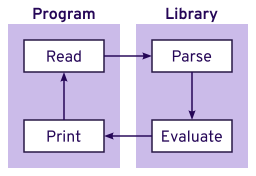

# RPN Calculator — CLI Program and Library

## Description

This is both a command line REPL program for performing calculations using reverse Polish notation, in addition to a library for enabling the creation of such programs. It supports addition, subtraction, multiplication, and division.

### Compiling

1. `npm install`  
   Install required tools and libraries
2. `make`  
   Compile the script
3. `node ./build/rpn-calc.js`  
   Run the script

### Usage

You will be presented with a prompt like so

    node ./build/rpn-calc.js
    >

You type a list of operations separated by spaces that affects an ongoing stack of numbers the program keeps track of. You can either type a number, whole or decimal fraction, to push directly on the stack or perform an operation on the two top-most values. Operations are performed as `n • m`, where `m` is the most recent value put on the stack and `n` is the second most recent value. The supported mathematical operations are:

Operation      | Symbol | Example
---------------|--------|--------------
Addition       | `+`    | `6 2 + == 8`
Subtraction    | `-`    | `6 2 - == 4`
Multiplication | `*`    | `6 2 * == 12`
Division       | `/`    | `6 2 / == 3`

When you are finished, you can type `q`, `Control + C` or `Control + D` to exit the program.

## Design and Architecture

The program follows a simple REPL architecture: reading input, parsing the input into valid operations, evaluating the operations, and then printing the result before looping back to reading again.

The library encompasses the underlying logic and processing, and the program is just a shell that takes input to pass to the library and displays the output for the current state.

In the library, the parser and the evaluator are designed as two separate pieces. The parser handles unknown input from the outside world and transforms it into a data type that represents valid operations. This data is then passed to the evaluator, which doesn't have to worry about the validity of what it received because all it receives is data that has been verified to be correct by the parser. This allows it to focus solely on evaluating the operations without becoming a mess of code, and the parser can just focus on turning text into operations. This separation of concerns allows for easier and more straightforward testing, in addition to helping quickly narrow scope during debugging.

The stack used is [Node][], running compiled [TypeScript][]. Testing is done using [Jest][].

## Retrospective

Several things immediately come to mind when thinking about what I could have done differently in this project, most of which boil down to not knowing the audience which I'm writing for:

1. **Use a language with a better developer experience.** TypeScript is a popular language for doing large-scale JavaScript development, but being popular does not always mean something is the best tool for the job. There are other compile-to-JavaScript languages with a better developer experience that could have been used instead, such as [Elm][][^1]. In retrospect, I should have asked for clarification on the exact requirements for this task and not assumed I needed to use the most mainstream option.

2. **Use immutable data structures.** Update: this is implemented as of [#1](https://github.com/68kheart/snap-mobile-coding-exercise/pull/1).  
   ~~You likely noticed defensiveness in ensuring things weren't and couldn't be mutated, despite my insistence on avoiding such practices. There is also overhead with how it was approached, which can been mitigated with [persistent data structures][]. In retrospect, I should have gone with my instinct and used [Immutable.js][] out of the gate instead of assuming it to possibly be foreign to others, if not a language that has immutability as one of its core features.~~

3. **Make branches to split up large commits into grouped, atomic commits.** This sort of behavior makes more sense when introducing new features, especially on an established codebase, but it would be helpful here in stepping through the development process in a more visible way.

There are also some features I wanted to implement while writing the program, but they would have involved a fair bit of effort without better tooling:

4. **Provide friendly errors.** Capturing position information to create a way to show specifically where issues occurred with bad input would have been wonderful. Combined with the REPL's ability to recall past inputs, it would make resolving errors quick and painless.

5. **Provide live calculation previews while typing.** Some REPLs provide instant feedback about what the result will be before you commit to whatever you're typing. I've found this helpful many times, and I believe it would be a good addition here, too.

## Author

Devan Ferguson (@68kHeart)

## License

Copyright © 2022 Devan Ferguson. All rights reserved.

You may not use or reproduce this code without explicit consent from the author.

[^1]: When evaluating frameworks for internal tools at my last job, React, Redux, and TypeScript was the widely recommended stack, which I tried during my evaluation of different solutions to meet our needs. Through Redux, my studies with Haskell, and enthusiastic recommendation by one of my partners, I tried Elm and ended up getting all the features the above stack promised and more. In all my work in building data processing tools and programs, I have not had a reason to switch away from it; I've found it fast, robust, and easier to understand than other compile-to-JavaScript languages. "Zero runtime errors" is also a great selling point I haven't found to be inaccurate in any way.

[Elm]: https://elm-lang.org "Elm homepage"

[Immutable.js]: https://immutable-js.com "Immutable.js homepage"

[Jest]: https://jestjs.io "Jest homepage"

[Node]: https://nodejs.org/ "Node.js homepage"

[persistent data structures]: https://en.wikipedia.org/wiki/Persistent_data_structure "Wikipedia: Persistent data structure"

[TypeScript]: https://www.typescriptlang.org "TypeScript homepage"
